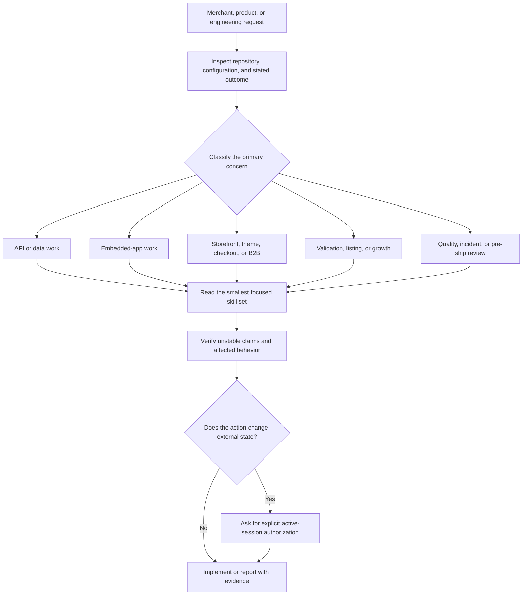

# Shopify App Builder: Shopify App Development Plugin for AI Coding Agents

[](https://www.npmjs.com/package/shopify-app-builder)
[](https://skills.sh/khadinakbarlabs/shopify-app-builder/using-shopify-app-builder)
[](https://agent-plugins.org/)
[](LICENSE)
[](https://shopify.dev/docs/apps)

Shopify App Builder is a production-focused, open-source Shopify app development plugin for AI coding agents. It now includes a real, read-only MCP server for ChatGPT, Codex, Claude, Cursor, and other MCP-capable harnesses, alongside the existing portable skills package for harnesses that only support local skills.

It is an [Agent Plugins 1.0](https://agent-plugins.org/) portable package: the root [`plugin.json`](plugin.json) uses the canonical standard schema and the shared [`skills/`](skills/) directory follows the fixed Agent Skills discovery layout. Native package surfaces remain available for Claude Code, OpenAI Codex, Cursor, and Gemini CLI, with portable installation for OpenCode, Command Code, Windsurf, Cline, Roo Code, Kilo Code, Continue, and other tools that support the `SKILL.md` Agent Skills format.

> This community project is not affiliated with, endorsed by, or sponsored by Shopify. Shopify and related marks belong to Shopify Inc.

## Contents

- [Why Shopify App Builder?](#why-shopify-app-builder)
- [MCP server for ChatGPT and coding agents](#mcp-server-for-chatgpt-and-coding-agents)
- [Install the local skills package](#install-the-local-skills-package)
- [What is included](#what-is-included)
- [Find the right skill quickly](#find-the-right-skill-quickly)
- [Guided delivery playbooks](#guided-delivery-playbooks)
- [Complete skill catalog](#complete-skill-catalog)
- [Commands and specialist agents](#commands-and-specialist-agents)
- [Agent-specific use cases and guidelines](#agent-specific-use-cases-and-guidelines)
- [Safety and credential handling](#safety-and-credential-handling)
- [Compatibility](#compatibility)
- [Troubleshooting](#troubleshooting)
- [Contributing](#contributing)
- [Frequently asked questions](#frequently-asked-questions)

## Why Shopify App Builder?

Shopify app work is rarely a single API call. A production-quality app needs the right API shape, secure authentication, a thoughtful embedded experience, reliable billing and webhooks, merchant-safe lifecycle handling, and a reviewable launch plan. This package gives an agent focused guidance for each of those concerns, then uses one routing skill to pick the smallest relevant set.

- **Start with intent, not a giant prompt.** `using-shopify-app-builder` routes a request such as “add a subscription plan” to billing, authentication, Polaris, and verification guidance instead of loading every skill.
- **Build for the whole lifecycle.** The catalog covers idea validation, implementation, quality, App Store readiness, and growth—not only code generation.
- **Keep consequential actions explicit.** Skills distinguish research and implementation from deployment, publication, access changes, and paid spend, which always need an active-session instruction.
- **Stay portable.** The same canonical `skills/` tree works across Agent Skills-compatible harnesses, with native adapters where a harness supports them.
- **Use an open package contract.** The root manifest declares only standard Agent Plugins metadata; commands, specialist agents, and native installation adapters remain clearly outside the portable core.

### Start with a real task

After installation, give your agent a concrete outcome. These are good first prompts:

```text
Use Shopify App Builder to scaffold a production-ready embedded app for product bundles.
Use Shopify App Builder to audit this app before Shopify App Store submission.
Use Shopify App Builder to diagnose this webhook signature verification failure.
Use Shopify App Builder to design a usage-based billing plan, then show the merchant approval flow.
```

If your harness does not trigger the router automatically, invoke `using-shopify-app-builder` explicitly before the task.

## MCP server for ChatGPT and coding agents

The public ChatGPT directory accepts this product through its MCP submission path, not as a skills ZIP. The included server exposes three safe, read-only tools:

- `search` locates focused Shopify engineering guidance.
- `fetch` retrieves one selected guidance document.
- `create_shopify_app_plan` creates a deterministic implementation plan and clearly preserves deployment, publication, billing, and store-change approval gates.

It does not connect to Shopify, access a merchant account, collect credentials, write to external systems, or contain a custom UI. The result is a transparent knowledge-and-planning MCP service rather than a disguised skills archive.

### Run locally

```bash
cd mcp-server
npm install
npm start
```

Connect any Streamable HTTP MCP client to `http://localhost:3000/mcp`. For Codex, add that URL in MCP settings (or `config.toml` under `[mcp_servers.shopify-app-builder]`). For Claude Code, Cursor, OpenCode, and other coding agents, create a remote Streamable HTTP MCP entry with the same URL.

Use the MCP Inspector before connecting a client:

```bash
npx @modelcontextprotocol/inspector
```

Choose **Streamable HTTP** and enter `http://localhost:3000/mcp`. The health endpoint is `http://localhost:3000/health`.

### Publish to the ChatGPT directory

Deploy the included server to a stable HTTPS URL, for example `https://mcp.example.com/mcp`, then create a **With MCP** submission in the OpenAI plugin portal. Do not upload a skills archive to that flow. The portal must scan the production endpoint and verify its domain before review.

The MCP runtime serves guidance and does not read verification credentials. If the submission portal requires domain verification, host its verification response separately through your hosting platform or reverse proxy. See [the MCP deployment guide](mcp-server/README.md) and [the submission checklist](docs/chatgpt-app-submission.md).

## Install the local skills package

### Claude Code

```text
/plugin marketplace add khadinakbarlabs/shopify-app-builder
/plugin install shopify-app-builder@shopify-app-builder
```

Claude Code discovers the plugin's skills, commands, and specialist agents.

### Codex

```bash
codex plugin marketplace add khadinakbarlabs/shopify-app-builder
codex plugin add shopify-app-builder@shopify-app-builder
```

If the installed Codex build does not support plugin marketplaces, use the portable Agent Skills command below with `--agent codex`.

### OpenCode

Install the published npm plugin in `opencode.json`:

```json
{
  "plugin": ["shopify-app-builder"]
}
```

The plugin registers its bundled `skills/` directory through OpenCode's native plugin configuration hook.

### Cursor, Command Code, and other coding agents

The open Agent Skills installer supports a broad and evolving set of harness profiles:

```bash
npx skills add khadinakbarlabs/shopify-app-builder --list
npx skills add khadinakbarlabs/shopify-app-builder --skill '*' --agent codex --copy --yes
```

Replace `codex` with `claude-code`, `cursor`, `opencode`, `command-code`, or another profile supported by your installed `skills` CLI. Use `--agent '*'` only when you intentionally want every detected agent configured.

Browse the public catalog entry on [skills.sh](https://skills.sh/khadinakbarlabs/shopify-app-builder/using-shopify-app-builder).

### Gemini CLI

```bash
gemini extensions install https://github.com/khadinakbarlabs/shopify-app-builder
```

### npm

```bash
npx shopify-app-builder install --agent codex --global
npx shopify-app-builder install --agent cursor --global
npx shopify-app-builder install --agent gemini-cli --global
npx shopify-app-builder install --all --dry-run
```

The npm installer copies only bundled skill directories. It has no runtime dependencies, no network calls, no telemetry, and no install or postinstall hook. Existing skills are skipped unless `--force` is explicitly supplied.

### Agent Plugins-compatible clients

The repository root is directly installable as a portable Agent Plugins package by clients that support the 1.0 format. Point the client at this checkout or a downloaded release directory; it discovers [`plugin.json`](plugin.json) first and then the immediate skill directories under [`skills/`](skills/). Installation UX is intentionally client-owned by the standard, so use the client’s documented directory/plugin installation command.

The portable core contains no MCP server configuration, no credential references, and no client-specific command, hook, or agent contract. That keeps the common surface useful to any Agent Plugins client while the native adapters retain each harness’s richer features.

### Clone or download

```bash
git clone https://github.com/khadinakbarlabs/shopify-app-builder.git
cd shopify-app-builder
npm test
npm run validate
```

### Verify your install

Use a narrow request first, then inspect the agent's selected skills and proposed verification steps. The package is documentation and installer code; it does not create a Shopify app, call Shopify APIs, or modify a store simply by being installed.

For a local source checkout, run the same release checks used before publishing:

```bash
npm test
npm run validate
```

## What is included

### Shopify engineering

- Admin GraphQL and legacy REST migration
- Shopify CLI, app configuration, and extensions
- App Bridge, Polaris, and embedded-app patterns
- OAuth, token exchange, managed install, session storage, and HMAC verification
- Billing, webhooks, Functions, Storefront API, Hydrogen, Liquid, metafields, metaobjects, B2B, and Markets
- Development troubleshooting and schema-ID validation

### Product quality

- Accessibility and WCAG-oriented reviews
- Performance budgets and Built for Shopify readiness
- Onboarding, empty/loading/error states, and merchant-pain prevention
- Polaris anti-patterns and modern embedded-app UX

### Launch and growth

- App idea validation and niche research
- Naming, pricing, listing optimization, and App Store SEO
- Shopify App Store advertising with explicit spend approval gates

Browse the complete catalog in [`skills/`](skills/).

The `using-shopify-app-builder` routing skill selects the smallest relevant skill set for each request and applies credential, verification, deployment, publication, and paid-spend boundaries.

## Find the right skill quickly

| Your task | Start with | Common follow-on skills |
| --- | --- | --- |
| Scaffold or configure an app | `shopify-cli` | `app-auth`, `app-bridge`, `polaris-ui` |
| Build Admin API features | `admin-graphql` | `metafields-metaobjects`, `webhooks`, `dev-troubleshooting` |
| Maintain a legacy REST integration | `admin-rest` | `admin-graphql`, `dev-troubleshooting` |
| Implement authentication or an app proxy | `app-auth` | `shopify-cli`, `webhooks` |
| Add subscriptions, usage charges, or trials | `app-billing` | `app-auth`, `merchant-pain-prevention` |
| Build checkout logic | `shopify-functions` | `shopify-cli`, `app-performance` |
| Build a customer-facing storefront | `storefront-api` or `hydrogen-storefront` | `b2b-markets`, `metafields-metaobjects` |
| Improve an embedded app experience | `top-app-ux-patterns` | `polaris-ui`, `ux-onboarding`, `ux-empty-error-states` |
| Prepare for quality or App Store review | `built-for-shopify-standards` | `app-accessibility`, `app-performance`, `merchant-pain-prevention` |
| Validate, position, price, or list an app | `app-validation` | `app-naming`, `app-pricing-strategy`, `app-listing-optimization` |
| Investigate a failure | `dev-troubleshooting` | the smallest domain-specific skill for the failing area |

You can always begin with `using-shopify-app-builder`; the table is useful when you want to direct the agent to a specific specialist immediately.

### A practical delivery path

1. Validate the merchant problem with `app-validation` and `app-niche-finder`.
2. Scaffold and authenticate with `shopify-cli` and `app-auth`.
3. Build the core workflow with Admin GraphQL, App Bridge, Polaris, and the appropriate commerce skills.
4. Add billing, webhook handling, accessibility, performance, and merchant-safety checks.
5. Use the review, listing, and growth skills only after the product experience is ready to verify.

## Example prompts

- “Build a Shopify app that lets merchants A/B test product titles.”
- “Audit this embedded app for Built for Shopify blockers.”
- “Debug this GraphQL 200 response with throttle errors.”
- “Add and verify an `orders/paid` webhook.”
- “Review this App Store listing for keyword relevance and conversion.”

## Repository layout

```text
plugin.json                Agent Plugins 1.0 portable manifest (standard core)
skills/                    Canonical, portable Agent Skills source of truth
commands/                  Claude Code workflow commands
agents/                    Claude Code specialist agents
.claude-plugin/            Claude Code manifest and marketplace metadata
.codex-plugin/             Codex manifest
.cursor-plugin/            Cursor manifest
.opencode/                 OpenCode plugin adapter
gemini-extension.json      Gemini CLI extension metadata
scripts/                   Dependency-free installer and release validation
docs/agents/               Harness-specific setup, use cases, and checks
assets/                    Artwork for manual directory uploads (not installed)
```

The project deliberately keeps domain knowledge in `skills/` and harness-specific packaging at the edges. The portable manifest uses a closed Agent Plugins field set; native adapters are distribution metadata, not portable manifest fields. Contributors should update the canonical skill first, then update an adapter only when the target harness needs one.

## Safety and credential handling

- The package contains no credentials and does not request Shopify credentials during installation.
- Credential examples use placeholders and environment variables.
- The release check rejects private keys, common live-token formats, personal filesystem paths, mismatched skill identifiers, and invalid Agent Plugins root manifests.
- Cache troubleshooting uses a recoverable backup script instead of `rm -rf`.
- Deployment, paid advertising, publication, and other consequential actions still require the user's explicit instruction in the active agent session.

See [SECURITY.md](SECURITY.md), [PRIVACY.md](PRIVACY.md), and [the release audit](docs/release-audit.md).

### What installation does not authorize

Installing this plugin does not grant an agent authority to publish an app, deploy infrastructure, change a Shopify store, accept legal terms, access credentials, or enable paid advertising. Those actions remain separate decisions for the person operating the agent. This is intentional: a useful Shopify engineering assistant should make high-impact work easier to review, not make it invisible.

## Compatibility

The portable core follows the Agent Plugins 1.0 contract: one root `plugin.json` with the canonical schema, a lowercase package identifier, and immediate `skills/<skill>/SKILL.md` children. The standard currently lists Cursor, VS Code, GitHub Copilot, ChatGPT & Codex, and Kiro among clients that support Agent Skills; each client remains responsible for its own installation and enablement flow.

Harness-specific commands and specialist agents remain under `commands/` and `agents/` for Claude Code, while every supported harness can load the `skills/` collection. No native-only field is added to the portable root manifest.

See [the compatibility matrix](docs/compatibility.md) for exact installation surfaces and limitations.

## Agent-specific use cases and guidelines

Each guide explains the best use cases, invocation style, operating boundaries, examples, and verification procedure for that harness:

- [Claude Code](docs/agents/claude-code.md)
- [Codex](docs/agents/codex.md)
- [Cursor](docs/agents/cursor.md)
- [OpenCode](docs/agents/opencode.md)
- [Command Code](docs/agents/command-code.md)
- [Gemini CLI](docs/agents/gemini-cli.md)
- [Other Agent Skills-compatible coding agents](docs/agents/other-agents.md)

## Accuracy and versioned APIs

Shopify APIs, CLI behavior, App Bridge, Polaris, review criteria, and advertising surfaces change over time. Skills identify their reference versions where practical, but agents must verify time-sensitive claims against current official Shopify documentation before shipping production code or spending money.

## Contributing

Bug fixes, source corrections, new tests, and focused Shopify skills are welcome. Read [CONTRIBUTING.md](CONTRIBUTING.md) and follow the security policy before opening a pull request.

## License

MIT. See [LICENSE](LICENSE).

---

## Guided delivery playbooks

These playbooks show how to turn a broad outcome into an agent task that stays focused, reviewable, and grounded in the current repository. They are starting points, not deployment runbooks: always inspect the project, verify current Shopify documentation, and approve consequential actions separately.

### 1. Build a new embedded admin app

**Goal:** turn a validated merchant problem into the smallest production-ready embedded app.

**Start with:** `using-shopify-app-builder` → `app-validation`, `shopify-cli`, `app-auth`, `app-bridge`, and `polaris-ui`.

**Give the agent:**

- The merchant problem and intended user.
- The expected first value moment after install.
- Whether the app will be public, custom, or internal.
- Any known constraints: supported plans, existing backend, deployment target, or required extensions.

**Prompt:**

```text
Use using-shopify-app-builder to plan a production-ready embedded Shopify app.
The merchant problem is: [problem].
The first value moment is: [observable outcome].
Inspect this repository before proposing changes. Return the smallest architecture,
required scopes, data model, routes, extension choices, risks, and verification plan.
Do not deploy or create Partner Dashboard resources.
```

**What a good result contains:**

1. An explicit problem statement and a small first release scope.
2. A framework-aware implementation plan rather than generic Shopify snippets.
3. Proposed scopes justified by a real feature, not by convenience.
4. Authentication, session, webhook, billing, and uninstall considerations.
5. Tests and live-surface checks that distinguish “the code builds” from “the merchant flow works.”

**Add when needed:** `app-niche-finder` for opportunity research, `app-billing` for paid plans, `shopify-functions` for checkout logic, and `merchant-pain-prevention` before the first merchant-facing release.

### 2. Replace a REST flow with Admin GraphQL

**Goal:** migrate a legacy integration safely without copying REST assumptions into a GraphQL implementation.

**Start with:** `admin-rest` → `admin-graphql` → `dev-troubleshooting`.

**Prompt:**

```text
Use admin-rest and admin-graphql to migrate this [resource/workflow] from REST.
First inspect the existing calls, scopes, error handling, pagination, and rate-limit behavior.
Then propose a minimal GraphQL replacement with variables, cursor pagination, cost handling,
and tests. Preserve unrelated changes and do not remove the REST path until parity is verified.
```

**Review checklist:**

- Is the GraphQL operation scoped to the fields the feature truly needs?
- Are global IDs, pagination cursors, user errors, and `extensions.cost` handled deliberately?
- Does a bulk operation make more sense than a request loop?
- Are retries based on an observed failure mode rather than an unconditional retry storm?
- Is the selected API version verified against the current official documentation?

### 3. Diagnose an OAuth, token exchange, or HMAC failure

**Goal:** fix the actual trust-boundary error rather than masking it with a broad retry or a weaker check.

**Start with:** `app-auth` + `webhooks` + `dev-troubleshooting`.

**Prompt:**

```text
Use app-auth and dev-troubleshooting to investigate this failure.
Inspect the current authentication flow, request validation, session storage, and the exact
error evidence. Identify the root cause before editing. Keep secrets out of logs and fixtures.
After the fix, add a focused regression test and state what still needs a live Shopify check.
```

**The agent should verify:**

- Request origin, redirect URI, and session type are appropriate to the route.
- Signature verification uses the raw body where required and a timing-safe comparison.
- Online and offline access tokens are not accidentally interchanged.
- Session records are scoped to the correct shop and user context.
- Error reporting is useful without emitting secrets, raw credentials, or signed URLs.

### 4. Add recurring or usage-based billing

**Goal:** give merchants clear pricing and a consent-driven billing flow.

**Start with:** `app-billing` + `app-pricing-strategy` + `merchant-pain-prevention`.

**Prompt:**

```text
Use app-billing, app-pricing-strategy, and merchant-pain-prevention to design this billing flow.
We need [flat tiered / usage-based / hybrid] pricing for [merchant outcome].
Inspect the current app, then propose plans, trial behavior, merchant approval UX, downgrade
handling, cancellation behavior, test-mode verification, and a focused implementation plan.
Do not create charges or change pricing in a live store.
```

**Merchant-first rules:**

- State what is billed, when, and how a merchant can change or cancel.
- Do not make a feature appear available before the merchant approves a charge.
- Handle a declined, expired, replaced, or cancelled subscription explicitly.
- Treat usage caps and thresholds as product decisions that need visible merchant context.
- Test against the relevant development or test environment before a production charge flow.

### 5. Build resilient webhook processing

**Goal:** make event handling secure, idempotent, observable, and safe to retry.

**Start with:** `webhooks` + `app-auth` + `dev-troubleshooting`.

**Prompt:**

```text
Use webhooks and app-auth to implement or review the [topic] webhook.
Inspect the framework's raw-body handling, HMAC verification, acknowledgement timing,
idempotency storage, retry behavior, and data-retention requirements. Produce a focused diff,
tests for duplicate delivery and invalid signatures, and a live verification checklist.
```

**Success is not only a 200 response.** A durable handler validates the request before parsing untrusted payloads, records a delivery identity before side effects, acknowledges quickly, and moves slow work to a retryable background path when the architecture supports it.

### 6. Improve a Polaris embedded-app screen

**Goal:** make a screen feel native to Shopify admin without losing product clarity or accessibility.

**Start with:** `app-bridge` + `polaris-ui` + `ux-polaris-antipatterns`.

**Add:** `ux-empty-error-states`, `ux-onboarding`, `app-accessibility`, and `app-performance` as the screen requires.

**Prompt:**

```text
Use app-bridge, polaris-ui, and ux-polaris-antipatterns to review this screen.
Inspect the selected route and nearby states. Recommend the smallest Polaris-compliant changes
that improve hierarchy, focus behavior, loading, empty, error, and partial-failure handling.
Show a focused diff and an accessibility verification checklist.
```

**Review questions:**

- Can a keyboard-only merchant complete the main task?
- Does focus move predictably after a dialog, save action, or inline error?
- Is there one primary action instead of competing calls to action?
- Do loading and empty states explain what the merchant can do next?
- Is a Toast, Banner, Modal, or inline validation message being used for its appropriate job?

### 7. Build a storefront, Hydrogen, or theme feature

**Goal:** choose the correct commerce surface before writing code.

**Start with one of:** `storefront-api`, `hydrogen-storefront`, or `liquid-themes`.

**Add:** `metafields-metaobjects`, `b2b-markets`, and `app-performance` when the product requirement needs them.

**Prompt:**

```text
Use the smallest relevant storefront skill to plan [feature].
This is a [Hydrogen storefront / Liquid theme / Storefront API client] and it must support
[markets, customer accounts, B2B, cart behavior, performance target].
Inspect the current implementation first. Explain why this surface is the right one, then
propose data access, caching, error states, and verification steps.
```

**Choose deliberately:**

| Requirement | Usually start with |
| --- | --- |
| Customer-facing product, cart, or account experience | `storefront-api` |
| React-based headless storefront on the Shopify stack | `hydrogen-storefront` |
| Online Store theme templates, sections, blocks, or Liquid | `liquid-themes` |
| Custom merchant data visible in one of those surfaces | `metafields-metaobjects` |
| Company accounts, catalogs, payment terms, or market-specific catalogs | `b2b-markets` |

### 8. Prepare for a quality or App Store review

**Goal:** surface blockers before the reviewer or merchant does.

**Start with:** `built-for-shopify-standards` + `merchant-pain-prevention` + `app-accessibility` + `app-performance`.

**Prompt:**

```text
Use built-for-shopify-standards, merchant-pain-prevention, app-accessibility, and app-performance
to run a blocker-first review of this repository. Separate verified evidence from assumptions.
Do not claim approval or certification. Rank issues by merchant impact and review risk, then
propose the smallest fixes and exact validation steps.
```

**A review should cover:**

- Authentication, scopes, and session handling.
- Webhook compliance, privacy surfaces, and uninstall cleanup.
- Embedded admin integration, Polaris consistency, and accessibility.
- Loading, failure, and empty-state behavior.
- Performance budgets, API costs, and observable production behavior.
- Support, billing clarity, listing copy, screenshots, and merchant expectations.

### 9. Validate, name, price, and position an app

**Goal:** establish evidence for the product before committing to a build or public claim.

**Start with:** `app-validation`, `app-niche-finder`, `app-naming`, and `app-pricing-strategy`.

**Prompt:**

```text
Use app-validation, app-niche-finder, app-naming, and app-pricing-strategy for this idea:
[idea]. Identify the merchant problem, alternatives, assumptions, first test, kill criteria,
name-screening steps, and pricing hypotheses. Separate verified facts from estimates and do not
claim market demand without source-backed evidence.
```

### 10. Improve a Shopify App Store listing

**Goal:** improve clarity and conversion without inventing proof, rankings, or outcomes.

**Start with:** `app-listing-optimization` + `top-app-ux-patterns`.

**Add:** `app-naming`, `app-pricing-strategy`, and `merchant-pain-prevention` when relevant.

**Prompt:**

```text
Use app-listing-optimization to audit this Shopify App Store listing.
Work only from verified product facts. Improve the title, tagline, description structure,
screenshot story, pricing explanation, and activation path. Flag claims that need evidence and
return a before/after outline rather than submitting anything externally.
```

### 11. Plan App Store advertising responsibly

**Goal:** build a measurable test plan before enabling any paid campaign.

**Start with:** `shopify-app-store-ads` + `app-listing-optimization` + `app-pricing-strategy`.

The ads skill is deliberately conservative. It should research, estimate, and prepare a campaign, but it must require explicit approval of the daily and total spend immediately before an ad is created or enabled.

### 12. Use Shopify MCP or agentic commerce safely

**Goal:** decide whether a merchant-facing or developer MCP surface belongs in the architecture.

**Start with:** `shopify-mcp`.

**Add:** the focused API, authentication, and webhook skills for the actual capabilities being exposed. Treat a tool description as an authorization boundary: validate identities, minimize scopes, return useful errors without leaking internals, and do not assume that a developer convenience flow is safe for production merchants.

## Complete skill catalog

Every directory in [`skills/`](skills/) is a standalone Agent Skill with a matching `name` in its YAML frontmatter. The router uses this collection as its source of truth.

### Platform, APIs, and commerce primitives

| Skill | Use it for | Pair it with |
| --- | --- | --- |
| [`admin-graphql`](skills/admin-graphql/SKILL.md) | Admin GraphQL queries, mutations, pagination, costs, bulk operations, and global IDs | `metafields-metaobjects`, `webhooks`, `dev-troubleshooting` |
| [`admin-rest`](skills/admin-rest/SKILL.md) | Maintaining a legacy REST integration or planning a migration | `admin-graphql`, `dev-troubleshooting` |
| [`shopify-cli`](skills/shopify-cli/SKILL.md) | App scaffolding, configuration, dev, deploy planning, and extension generation | `app-auth`, `app-bridge`, `shopify-functions` |
| [`shopify-functions`](skills/shopify-functions/SKILL.md) | Checkout and order-pipeline Functions | `shopify-cli`, `admin-graphql` |
| [`storefront-api`](skills/storefront-api/SKILL.md) | Customer-facing catalog, cart, checkout, and account experiences | `b2b-markets`, `metafields-metaobjects` |
| [`hydrogen-storefront`](skills/hydrogen-storefront/SKILL.md) | Hydrogen storefront architecture, routing, caching, and deployment patterns | `storefront-api`, `app-performance` |
| [`liquid-themes`](skills/liquid-themes/SKILL.md) | Themes, sections, blocks, templates, Liquid, and theme extensions | `metafields-metaobjects`, `app-accessibility` |
| [`metafields-metaobjects`](skills/metafields-metaobjects/SKILL.md) | Custom data definitions, querying, and theme access | `admin-graphql`, `liquid-themes` |
| [`b2b-markets`](skills/b2b-markets/SKILL.md) | B2B catalogs, company locations, Markets, currencies, and payment terms | `storefront-api`, `admin-graphql` |
| [`shopify-mcp`](skills/shopify-mcp/SKILL.md) | Shopify MCP setup, agentic commerce, and tool-surface design | `app-auth`, `admin-graphql` |

### Authentication, billing, events, and reliability

| Skill | Use it for | Pair it with |
| --- | --- | --- |
| [`app-auth`](skills/app-auth/SKILL.md) | OAuth, token exchange, managed install, app proxy, sessions, and HMAC verification | `webhooks`, `dev-troubleshooting` |
| [`app-billing`](skills/app-billing/SKILL.md) | Recurring, usage-based, one-time, and hybrid billing | `app-pricing-strategy`, `merchant-pain-prevention` |
| [`webhooks`](skills/webhooks/SKILL.md) | Delivery configuration, signatures, retries, idempotency, and event handling | `app-auth`, `dev-troubleshooting` |
| [`dev-troubleshooting`](skills/dev-troubleshooting/SKILL.md) | CLI, tunnel, auth, API, iframe, webhook, and deployment investigation | the affected domain skill |
| [`app-performance`](skills/app-performance/SKILL.md) | Embedded-app performance, API cost, bundle, cache, and latency review | `app-bridge`, `admin-graphql` |
| [`merchant-pain-prevention`](skills/merchant-pain-prevention/SKILL.md) | Uninstall hygiene, billing clarity, support friction, and avoidable merchant harm | `app-billing`, `built-for-shopify-standards` |

### Embedded-app UX and quality

| Skill | Use it for | Pair it with |
| --- | --- | --- |
| [`app-bridge`](skills/app-bridge/SKILL.md) | App Bridge web components, session tokens, resource pickers, and embedded navigation | `polaris-ui`, `app-auth` |
| [`polaris-ui`](skills/polaris-ui/SKILL.md) | Polaris components, forms, page structure, tokens, and common UI composition | `ux-polaris-antipatterns`, `app-accessibility` |
| [`app-accessibility`](skills/app-accessibility/SKILL.md) | WCAG-oriented embedded-app accessibility, focus, contrast, ARIA, and screen readers | `polaris-ui`, `app-bridge` |
| [`ux-empty-error-states`](skills/ux-empty-error-states/SKILL.md) | Empty, loading, error, partial-failure, and optimistic UI states | `polaris-ui`, `dev-troubleshooting` |
| [`ux-onboarding`](skills/ux-onboarding/SKILL.md) | First-run experience, activation, setup choices, and time to value | `top-app-ux-patterns`, `app-validation` |
| [`ux-modern-app-feel`](skills/ux-modern-app-feel/SKILL.md) | Calm, fast, keyboard-aware, opinionated embedded experiences | `polaris-ui`, `app-performance` |
| [`ux-polaris-antipatterns`](skills/ux-polaris-antipatterns/SKILL.md) | Review deprecated or off-pattern Polaris usage | `polaris-ui`, `app-accessibility` |
| [`top-app-ux-patterns`](skills/top-app-ux-patterns/SKILL.md) | Information architecture, onboarding, dashboards, pricing, and listing UX patterns | `ux-onboarding`, `app-listing-optimization` |
| [`built-for-shopify-standards`](skills/built-for-shopify-standards/SKILL.md) | Readiness gaps across quality, performance, accessibility, and support | `merchant-pain-prevention`, `app-performance` |

### Product strategy, launch, and growth

| Skill | Use it for | Pair it with |
| --- | --- | --- |
| [`app-validation`](skills/app-validation/SKILL.md) | Pre-build validation, merchant interviews, tests, and kill criteria | `app-niche-finder`, `app-pricing-strategy` |
| [`app-niche-finder`](skills/app-niche-finder/SKILL.md) | Opportunity discovery from merchant pain and competitor gaps | `app-validation`, `app-naming` |
| [`app-naming`](skills/app-naming/SKILL.md) | Name candidates, trademark-screening steps, domains, and App Store wording | `app-listing-optimization`, `app-validation` |
| [`app-pricing-strategy`](skills/app-pricing-strategy/SKILL.md) | Pricing models, trials, tiers, caps, and pricing copy | `app-billing`, `merchant-pain-prevention` |
| [`app-listing-optimization`](skills/app-listing-optimization/SKILL.md) | App Store page structure, screenshots, keywords, and conversion review | `top-app-ux-patterns`, `app-naming` |
| [`shopify-app-store-ads`](skills/shopify-app-store-ads/SKILL.md) | Researching and planning App Store ads with explicit spend gates | `app-listing-optimization`, `app-pricing-strategy` |

### Router

| Skill | Use it for | What it does |
| --- | --- | --- |
| [`using-shopify-app-builder`](skills/using-shopify-app-builder/SKILL.md) | Any broad Shopify app task | Inspects the request, selects the smallest relevant skills, requires current-doc verification for unstable facts, and preserves credential, deployment, publication, and spend boundaries. |

## Commands and specialist agents

Claude Code users also receive workflow commands and specialist agents. Other harnesses receive the same underlying knowledge through the portable skills, but should not assume that Claude-specific orchestration primitives are native elsewhere.

### Workflow commands

| Command | Use it when | Expected outcome |
| --- | --- | --- |
| [`/init-shopify-app`](commands/init-shopify-app.md) | Starting a new app | A guided scaffold and configuration plan |
| [`/graphql`](commands/graphql.md) | Writing or debugging Admin GraphQL | A focused query or mutation workflow |
| [`/add-webhook`](commands/add-webhook.md) | Adding an event subscription | A secure handler and verification checklist |
| [`/audit-scopes`](commands/audit-scopes.md) | Reviewing requested permissions | A minimal-scope report with rationale |
| [`/deploy-app`](commands/deploy-app.md) | Preparing a deployment | A verification-first deployment checklist; no implicit release |
| [`/generate-extension`](commands/generate-extension.md) | Adding an app extension | A scoped extension-generation workflow |
| [`/migrate-rest-to-graphql`](commands/migrate-rest-to-graphql.md) | Replacing legacy REST | A migration plan and parity checks |
| [`/optimize-listing`](commands/optimize-listing.md) | Improving a store listing | Evidence-bound listing recommendations |
| [`/validate-idea`](commands/validate-idea.md) | Testing an app concept | A validation plan with assumptions and kill criteria |

### Specialist agents

| Specialist | Best bounded assignment | Main-session boundary |
| --- | --- | --- |
| [`shopify-app-architect`](agents/shopify-app-architect.md) | Smallest viable architecture and implementation sequence | Keep environment creation, deployment, and external commitments in the user conversation |
| [`graphql-query-writer`](agents/graphql-query-writer.md) | A precise GraphQL operation, variables, and error handling | Verify scopes, API versions, and real data behavior before production use |
| [`shopify-debugger`](agents/shopify-debugger.md) | Root-cause investigation from reproducible evidence | Do not expose secrets or declare a live system fixed without validation |
| [`shopify-app-ux-reviewer`](agents/shopify-app-ux-reviewer.md) | A focused embedded UX or accessibility review | Treat screenshots and source as evidence, not proof of live behavior |
| [`app-listing-copywriter`](agents/app-listing-copywriter.md) | Evidence-bound listing copy and screenshot narrative | Do not submit, promise rankings, or invent outcomes |

## Agent-specific use cases and operating patterns

The canonical skills are shared. What changes by harness is installation, how skill discovery works, and which native components are available.

### Claude Code: commands, specialists, and natural-language routing

Use Claude Code when you want the complete package surface: the canonical skills plus slash commands and five specialist agents.

**Strong fits**

- End-to-end architecture work that benefits from a bounded specialist review.
- Repeated workflows such as scope review, webhook setup, or listing review.
- Projects where you want the agent to move from a broad request to a small, explicit skill set.

**Good opening prompt**

```text
Use shopify-app-architect to design the smallest production architecture for this app idea.
Read only the relevant Shopify App Builder skills, inspect the repository, and return a build order.
```

**Before accepting an answer**

- Check that the command or specialist named the evidence it used.
- Check that a deployment, submission, or paid action was not treated as automatic.
- Ask for an exact test or live-surface verification plan when the change touches a merchant flow.

See the full [Claude Code guide](docs/agents/claude-code.md).

### OpenAI Codex: repository evidence and focused implementation

Use Codex for repository-wide implementation, shell-backed diagnostics, and changes that need file-level verification. The native manifest exposes the portable skills; Claude-specific commands and agents are intentionally not presented as universal Codex primitives.

**Strong fits**

- Authenticating, webhook, billing, scope, and API reviews where source and tests matter.
- Refactors that require preserving unrelated work in a dirty tree.
- Debugging an observed CLI, GraphQL, or embedded-app error from command output.

**Good opening prompt**

```text
Use using-shopify-app-builder to route this request, inspect the repository,
then fix the webhook HMAC verification failure with a focused test.
```

**Before accepting an answer**

- Ask for the changed files and focused test result.
- Keep a real Partner Dashboard or production check separate from a passing local test.
- Require current official documentation for volatile API or policy guidance.

See the full [Codex guide](docs/agents/codex.md).

### Cursor: in-editor implementation and diff review

Use Cursor when the active editor context is the fastest way to inspect a route, component, config file, or selected diff. Name a skill if automatic routing is ambiguous.

**Strong fits**

- Polaris and App Bridge component work in a visible UI context.
- Small extensions, handlers, and selected-file reviews.
- Refactoring a route while keeping its tests and configuration nearby.

**Good opening prompt**

```text
Use polaris-ui and ux-polaris-antipatterns to review the selected route.
Return a focused diff, explain the merchant impact, and include a verification command.
```

**Before accepting an answer**

- Include the relevant `shopify.app.toml`, route, extension, and schema files in context.
- Do not paste live credentials into the chat.
- Treat a preview as a draft until the merchant flow has been tested.

See the full [Cursor guide](docs/agents/cursor.md).

### OpenCode: terminal-led implementation and diagnostics

Use OpenCode for command-driven implementation, CLI output, and project-wide investigation. Its native adapter registers the canonical skills directory; the portable path remains available if the package surface is not appropriate.

**Good opening prompt**

```text
Load using-shopify-app-builder, inspect this repository, and diagnose why shopify app dev fails.
Use the smallest relevant skills and show the exact observed evidence before proposing a fix.
```

See the full [OpenCode guide](docs/agents/opencode.md).

### Command Code: explicit command-oriented tasks

Use Command Code when you want a small, named set of domain skills in a command-led workflow. Include the repository path and the expected artifact or verification result.

**Good opening prompt**

```text
Use app-auth and webhooks to audit this handler. Report the trust-boundary risks first,
then propose a focused patch and test plan.
```

See the full [Command Code guide](docs/agents/command-code.md).

### Gemini CLI: large-context review and planning

Use Gemini CLI for repository and documentation reviews, architecture comparisons, and scoped plans that another agent can implement. `GEMINI.md` supplies extension context while the shared skills remain the domain source.

**Good opening prompt**

```text
Use Shopify App Builder to review this architecture. Separate repository facts from assumptions,
identify missing auth, billing, and webhook boundaries, and produce a blocker-first plan.
```

See the full [Gemini CLI guide](docs/agents/gemini-cli.md).

### Other Agent Skills-compatible harnesses

Windsurf, Cline, Roo Code, Kilo Code, Continue, and similar tools can use the portable skill tree where their installed version supports the Agent Skills convention. Automatic triggering differs, so invoke `using-shopify-app-builder` explicitly when in doubt.

**Good opening prompt**

```text
Read the using-shopify-app-builder skill and route this request.
Then use webhooks and app-auth to review this handler without exposing credentials.
```

See the [other coding-agent guide](docs/agents/other-agents.md) for portable installation and verification.

## Routing model in detail

The router is deliberately small and procedural. It is designed to prevent the most common failure mode in large skill bundles: loading everything and producing generic, contradictory, or context-free advice.



### The router's five operating rules

1. **Inspect before prescribing.** Framework, API version, session storage, deployment provider, and existing conventions are project facts—not defaults to guess.
2. **Minimize loaded knowledge.** Use one or two specialist skills when they cover the request; add more only for an actual boundary such as billing, a webhook, or accessibility.
3. **Verify changing facts.** API versions, review criteria, CLI behavior, pricing rules, and advertising products can change. Source code and a prior answer are not enough.
4. **Separate evidence from inference.** A test, build, static scan, and live merchant flow each prove different things.
5. **Keep authority explicit.** A request to research or plan does not authorize deploying, publishing, changing billing, spending money, or handling credentials.

## Verification cookbook

Use this section to ask for the right proof after a change. The exact commands depend on the application stack, but the distinction between checks is portable.

| Change type | Minimum local evidence | Additional evidence before calling it complete |
| --- | --- | --- |
| Admin GraphQL operation | Unit or integration test, variables, user-error path, cost handling | A controlled store/dev environment call with the correct scopes |
| OAuth or token exchange | Focused authentication tests and session-store inspection | Real redirect/install flow without exposing credentials |
| Webhook handler | Invalid-signature, valid-signature, duplicate-delivery, and failure-path tests | A controlled delivery and observable idempotent result |
| Billing UX | Plan-state tests and merchant approval/cancel states | Test-mode or development-store confirmation flow |
| Polaris route | Component or route test plus keyboard/focus review | Screen-reader and real embedded-admin validation when applicable |
| Function or extension | Build/lint and targeted runtime fixtures | Platform-specific deployment or dev-preview evidence |
| Storefront feature | Data-state, cart/account, loading/error tests | Real browser and market/account state validation |
| Listing copy | Source-backed product facts and claim review | Human approval before publishing externally |
| Paid acquisition plan | Budget model, keyword rationale, and stop criteria | Explicit daily and total spend approval before activation |

### A completion-report template

Ask an agent to close work in this shape:

```text
Outcome
- What changed or what was concluded.

Evidence
- Files inspected or modified.
- Commands run and their result.
- Live or controlled-surface checks, if any.

Remaining risk
- Facts that need current official verification.
- External actions that still require approval.
- Assumptions that were not validated.
```

## Troubleshooting

### The agent did not automatically use a skill

Name the router or the skill directly:

```text
Use using-shopify-app-builder before answering.
Use app-auth and webhooks for this task.
```

Automatic trigger behavior is owned by the harness. A successful installation means the files are in the expected directory; it does not guarantee that every harness will activate them from every natural-language phrase.

### The installer reports an existing skill

The npm installer skips existing skill folders by default to avoid silently replacing local edits. Review the target first, then use `--force` only when you intentionally want the packaged version to replace it.

```bash
npx shopify-app-builder install --agent codex --global --dry-run
npx shopify-app-builder install --agent codex --global --force
```

### The marketplace command is unavailable

Use the portable installer for the affected harness:

```bash
npx skills add khadinakbarlabs/shopify-app-builder --skill '*' --agent codex --copy --yes
```

Replace `codex` with your supported harness profile. Run `npx skills add khadinakbarlabs/shopify-app-builder --list` first if you are unsure which profiles your installed CLI supports.

### A skill conflicts with repository conventions

Treat the repository as evidence. Tell the agent which framework, deployment provider, database, test runner, and local conventions exist; ask it to adapt the domain guidance rather than replacing the project's architecture wholesale.

### A skill mentions an old Shopify version, rate limit, or policy

Do not treat static skill text as a final source for time-sensitive platform facts. Ask the agent to verify the specific claim in current official Shopify documentation before using it in production code, a review submission, pricing decision, or paid campaign.

### A task needs credentials

Do not put credentials in a prompt, issue, README, fixture, or shell history. Use the harness and deployment environment's secret-management approach, keep examples placeholder-only, and ask for the smallest credential scope required by the task.

### A generated change looks too broad

Stop and narrow the task:

```text
Do not refactor unrelated files. Explain the smallest safe change first,
then implement only that change and run focused verification.
```

### A deployment or listing submission is proposed

Ask for the exact target, visible change, rollback or recovery path, and proof plan. An agent may prepare artifacts and drafts, but a consequential external action needs a fresh, explicit instruction from the person responsible for it.

## Frequently asked questions

### Is this an official Shopify plugin?

No. This is an independent open-source project. It is not affiliated with, endorsed by, or sponsored by Shopify.

### Does installing it connect an agent to my Shopify store?

No. Installation copies or registers guidance files and manifests. It does not create an app, obtain a token, call Shopify APIs, or modify a store.

### Is it a replacement for Shopify documentation?

No. It is a workflow and engineering aid. Use it to identify the right questions, implementation patterns, and checks; verify time-sensitive platform facts against current official documentation.

### Which skill should I use first?

Use `using-shopify-app-builder` for a broad task. Name a specialist directly only when the primary concern is already clear, such as `app-auth` for OAuth or `admin-graphql` for an API query.

### Can I install only one skill?

Yes. Use the Agent Skills installer with a named skill instead of `--skill '*'` when your workflow only needs a narrow concern. The exact syntax depends on the installed `skills` CLI; use `--list` to inspect available options.

### Can I use it in a private repository?

Yes. The portable skills and package adapters are source artifacts. Follow your own repository, credential, and deployment policies when installing them in a private project.

### Does it include an MCP server?

Yes. The `mcp-server/` directory provides a read-only Streamable HTTP MCP service with `search`, `fetch`, and `create_shopify_app_plan`. It reads the checked-in guidance corpus only; it does not connect to Shopify, request credentials, or change external systems. The optional `shopify-mcp` skill remains guidance for evaluating merchant-facing Shopify MCP designs.

### Does it make an app Built for Shopify?

No. The quality-related skills help prepare and audit an app, but only Shopify controls its review processes and any resulting status. Treat the output as a readiness aid, not a certification claim.

### Does it guarantee App Store approval, ranking, or revenue?

No. The listing, pricing, validation, and advertising skills provide evidence-oriented guidance and checklists. They do not guarantee review approval, search ranking, install volume, conversion, or commercial outcomes.

### Can an agent enable ads or create charges after reading these skills?

Not without an explicit instruction in the active session. The skills intentionally require a clear approval boundary for paid spend, billing changes, deployment, publication, and other consequential actions.

### Why does the README use “Shopify” in the project description?

The project describes the ecosystem it supports. It does not claim affiliation with Shopify; see the trademark notice near the top of this README.

### Where should I report a security issue?

Follow [SECURITY.md](SECURITY.md). Do not open a public issue containing a credential, exploit path, store data, or sensitive reproduction detail.

### How do I update an installation?

Update the source or npm package using your normal package workflow, then re-run the relevant installer. Review local changes before using `--force`, because a forced copy can intentionally replace installed skill directories.

## Contributor workflow

### Add or improve a skill

1. Choose a narrow, durable Shopify concern that is not already covered.
2. Create or update one directory under `skills/` with a `SKILL.md` file.
3. Keep the YAML `name` lowercase, hyphenated, and equal to its directory name.
4. State when to use the skill, when not to use it, required inputs, safe defaults, examples, verification, and authority boundaries.
5. Link to current official sources for volatile platform facts rather than hard-coding unsupported claims.
6. Add focused tests or release-validation coverage when the package structure or installer behavior changes.
7. Run the validation commands below before opening a pull request.

### Review a documentation or skill change

Use this checklist:

- Does every claim have a clear scope and avoid implying a guaranteed external outcome?
- Are API versions, rate limits, policies, and review criteria marked as time-sensitive where necessary?
- Are token, secret, URL, and filesystem examples safe placeholders?
- Does the skill ask for explicit approval before a consequential action?
- Are framework-specific snippets labeled with their assumptions?
- Is the new guidance smaller and more actionable than a generic tutorial?

### Run the release checks

```bash
npm test
npm run validate
```

The release validator checks package structure, manifest consistency, skill naming, unsafe packaged files, common live-token shapes, private-key material, personal filesystem paths, and other release hygiene constraints. Passing it is an important source check, not proof that an external marketplace, Shopify account, deployment, or merchant flow is ready.

## Prompt library

Use these prompts as copy-and-adapt starting points. Replace bracketed text with facts from your repository or product; do not ask an agent to guess those facts.

### Planning and architecture

```text
Use using-shopify-app-builder to route this request.
We are building [outcome] for [merchant/user]. The current repository uses [stack].
Inspect the project before proposing changes. Return the smallest architecture, required Shopify
surfaces, data flow, risk register, build order, and verification plan. Do not create or deploy anything.
```

```text
Use shopify-app-architect to compare these two approaches: [A] and [B].
Evaluate merchant value, scopes, maintenance cost, extension constraints, billing implications,
failure modes, and the evidence we still need. Recommend one option only if the tradeoff is clear.
```

```text
Use app-validation to turn this idea into a one-week test plan.
State the problem, target merchant, riskiest assumption, interview questions, landing-page test,
success threshold, kill criteria, and what not to build yet.
```

### Admin API and data work

```text
Use admin-graphql for this feature: [feature].
Inspect the existing API client and types. Design the smallest query or mutation, with variables,
user-error handling, pagination or bulk-operation strategy, and cost-aware retry behavior.
Add a focused test but do not call a live store.
```

```text
Use admin-rest and admin-graphql to audit this legacy REST workflow.
List each REST call, its data dependency, pagination behavior, scopes, retries, and error path.
Then propose a staged GraphQL migration with parity tests and a rollback decision point.
```

```text
Use metafields-metaobjects to model [merchant data].
Compare a metafield, metaobject, database record, and app-owned configuration for this use case.
Recommend one model, naming convention, validation strategy, Admin GraphQL operations, and theme/storefront access path.
```

### Authentication, permissions, and events

```text
Use app-auth to review this route and its session assumptions.
Identify required scopes, session type, redirect validation, token-exchange handling, and every place
untrusted input crosses a trust boundary. Propose only the minimal code changes and focused tests.
```

```text
Use /audit-scopes (or app-auth) to minimize the permissions in this app configuration.
Map every scope to a user-visible feature. Flag each scope that has no demonstrated need and explain
the merchant impact of removing it. Do not modify the Partner Dashboard.
```

```text
Use webhooks and app-auth to review this event handler.
Require raw-body signature verification, idempotency, acknowledgement timing, duplicate delivery
tests, controlled retries, and an observable failure path. Keep credentials and customer data out of logs.
```

### Embedded UI and merchant experience

```text
Use app-bridge, polaris-ui, and app-accessibility to implement [screen or interaction].
Preserve the current route architecture. Include keyboard flow, focus restoration, semantic labels,
loading state, empty state, error state, and a compact visual/functional verification checklist.
```

```text
Use ux-empty-error-states to review this screen's asynchronous states.
Inventory every pending, empty, permission-denied, network, partial-failure, and success path.
Recommend the correct Polaris primitive for each and show the smallest implementation change.
```

```text
Use ux-onboarding and top-app-ux-patterns to improve first-run activation.
The merchant should reach [aha moment] within [time]. Audit the current first screen, setup choices,
primary action, deferred configuration, and metrics. Avoid adding a long wizard without evidence.
```

### Billing and merchant trust

```text
Use app-billing and merchant-pain-prevention to review this paywall.
Verify that a merchant understands the plan, price, trial, usage cap, approval action, cancellation,
downgrade behavior, and what happens when payment fails. Return copy and state-machine changes only.
```

```text
Use app-pricing-strategy to develop three pricing hypotheses for [outcome].
For each, state the value metric, included limit, trial approach, upgrade trigger, support burden,
and the evidence required before release. Do not create charges or alter a live plan.
```

### Storefronts, themes, B2B, and checkout

```text
Use storefront-api to design [customer-facing feature].
Specify the data contract, token exposure assumptions, cart/account behavior, market context,
loading/error states, caching, and browser verification. Do not use the Admin API for customer UI.
```

```text
Use liquid-themes to implement [section/block/template feature].
Inspect the existing theme conventions and schema. Return a minimal, Theme Check-friendly change
with editor settings, sensible defaults, localization, responsive behavior, and accessibility checks.
```

```text
Use shopify-functions to review this checkout customization.
Validate the target, input query, constraints, deterministic behavior, error strategy, test fixtures,
and deployment prerequisites. Do not deploy the function.
```

```text
Use b2b-markets to assess this requirement: [B2B or market requirement].
Identify whether it needs company locations, catalogs, Markets context, payment terms, customer accounts,
or a separate architecture. State plan and platform assumptions explicitly.
```

### Quality, release, and growth

```text
Use built-for-shopify-standards, app-accessibility, app-performance, and merchant-pain-prevention
for a blocker-first pre-ship review. Inspect the repository and return evidence, severity, owner,
smallest remediation, and validation command for each finding. Do not claim certification or approval.
```

```text
Use app-listing-optimization to improve this listing from verified product facts only.
Draft a title, tagline, description outline, screenshot narrative, pricing explanation, and support
expectations. Flag every outcome claim that needs customer evidence before publishing.
```

```text
Use shopify-app-store-ads to prepare a conservative acquisition experiment.
Define the target merchant, keywords, exclusions, landing/listing readiness, budget model, success metric,
stop rule, and reporting cadence. Stop before campaign creation and request explicit spend approval.
```

## Preflight checklists

### Before asking an agent to write code

- [ ] State the merchant/user outcome in one sentence.
- [ ] Provide the repository path, framework, and relevant files.
- [ ] Identify whether this is an admin app, storefront, theme, checkout customization, or B2B surface.
- [ ] Include the actual failure message, reproduction, or expected behavior when debugging.
- [ ] State whether the task is a plan, a local code change, a deployment, or an external submission.
- [ ] Say which files or systems must not change.
- [ ] Ask for focused verification proportionate to the risk.

### Before accepting a code change

- [ ] The change is limited to the stated problem.
- [ ] The API version, scopes, and platform behavior are verified where time-sensitive.
- [ ] Inputs, identities, and signatures are validated at trust boundaries.
- [ ] Errors are actionable without containing credentials or sensitive merchant data.
- [ ] Idempotency, retries, and partial failures are considered where events or background jobs are involved.
- [ ] The UI includes loading, empty, error, and success feedback appropriate to the feature.
- [ ] Tests and/or manual checks cover the behavior that actually changed.
- [ ] The completion report distinguishes source evidence from live-surface evidence.

### Before a deployment or publication

- [ ] The exact environment, account, store, branch, and version are identified.
- [ ] A rollback, recovery, or support path exists.
- [ ] Required merchant approvals, billing consent, and disclosure copy are present.
- [ ] Production secrets are managed outside source, prompts, and logs.
- [ ] The relevant app, storefront, extension, or listing has been checked on the real target surface.
- [ ] A person responsible for the external action explicitly approves it in the active session.

### Before enabling paid acquisition

- [ ] The product and listing are ready to convert a qualified install.
- [ ] Daily budget, total budget, bid/keyword approach, and stop rule are written down.
- [ ] Conversion and retention events are measurable.
- [ ] The experiment distinguishes clicks, installs, activation, trial, and paid conversion.
- [ ] The final activation has explicit spend approval.

## Maintenance guide

### Update the plugin safely

This project is designed around one canonical skills tree. When changing domain guidance:

1. Update the relevant `skills/<name>/SKILL.md` file first.
2. Keep its frontmatter `name` equal to the directory name.
3. Update a harness adapter only if that adapter contains genuinely harness-specific installation or discovery behavior.
4. Review every public claim for time sensitivity, scope, and external-proof requirements.
5. Run `npm test` and `npm run validate`.
6. Test the intended installation surface in a clean harness session when changing packaging or installation behavior.

### Update a release

For a source or npm release, verify the public package surface rather than relying only on the repository tree:

```text
1. Confirm the version, manifest metadata, README links, license, privacy, terms, and support links.
2. Run the unit tests and release validator.
3. Inspect the package contents for source-only files, personal paths, credentials, symlinks, and unexpected artifacts.
4. Publish only after the intended public package content is verified.
5. Reinstall from the published source in a clean target or dry-run the installer.
```

### Update platform facts

Shopify platform details have different lifetimes. Treat these as requiring an official-source refresh before high-stakes use:

| Fact type | Refresh before |
| --- | --- |
| Admin, Storefront, or Functions API versions | Implementing or shipping a production change |
| Rate limits, quotas, and resource availability | Writing retry, bulk, or performance behavior |
| Billing, revenue share, and pricing policy | Pricing, merchant communications, or charge implementation |
| App review and Built for Shopify criteria | A readiness claim or submission |
| App Store advertising inventory or policy | Creating or enabling a campaign |
| CLI, App Bridge, Polaris, or template behavior | Updating a live project or migration path |

### Keep examples safe

Examples should be directly useful without becoming accidental production configuration:

- Use environment-variable placeholders rather than token-shaped strings.
- Do not include personal filesystem paths or user names in commands.
- Keep URLs generic unless the URL is a public, maintained project resource.
- Do not use a real merchant, shop domain, customer, order, or payload in a fixture.
- Mark pseudo-code and framework-specific snippets with their assumptions.

## Glossary

| Term | Meaning in this project |
| --- | --- |
| **Agent Skill** | A directory containing a `SKILL.md` file with focused domain guidance and a stable lowercase-hyphenated name. |
| **Router** | `using-shopify-app-builder`, the skill that chooses the smallest relevant set for a broad task. |
| **Native surface** | A harness-specific manifest or adapter included for a tool that can load plugins directly. |
| **Portable surface** | The shared `skills/` directory, installable by Agent Skills-compatible tools. |
| **Evidence** | A directly observed fact: source, test output, command output, visible UI state, or controlled live result. |
| **Inference** | A conclusion drawn from evidence that should be labeled as such and may need validation. |
| **Consequential action** | An action that changes an external system, access, money, public content, deployment, or merchant-facing state. |
| **Live-surface verification** | Checking the actual app, store, dashboard, deployment, or directory page instead of inferring success from source or a local build. |
| **Merchant-safe** | Clear consent, predictable outcomes, cleanup, recoverability, and support-aware behavior that avoids avoidable merchant harm. |

## Release-note template

Use this format when documenting a meaningful plugin update:

```md
## [Version] — YYYY-MM-DD

### Added
- New skills, adapters, commands, or documentation.

### Changed
- Behavior, guidance, compatibility, or installation updates.

### Fixed
- Specific incorrect, unsafe, or broken behavior.

### Verification
- Tests, validators, and clean-install checks run.

### Compatibility notes
- Any harness, API, platform, or migration caveat.
```

Keep release notes concrete. Do not claim marketplace listing, external review, certification, or install success unless it was verified on the relevant live surface.
